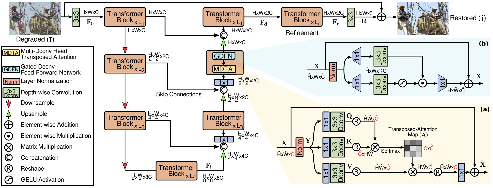

## 总述
请简练地概括项目的主要贡献，使读者可以快速理解并复现你的工作，包括：
- 图像去模糊 Restormer(https://github.com/swz30/Restormer.git)
- 优化效果（精度和加速比），简单给出关键的数字即可，在这里不必详细展开
- 在Docker里面代码编译、运行步骤的完整说明
  - 请做到只要逐行运行你给的命令，就能把代码跑起来，比如从docker pull开始

## 原始模型
### 模型简介
请介绍模型的基本信息，可以包含但不限于以下内容：
- 去除图像模糊or噪声
- 业界使用情况着实不清楚，纯粹为了比赛选的
- 模型也是基于transformer，具体情况还不清楚
  

### 模型优化的难点
- 目前遇到模型导出onnx，PixelShuffle和PixelUnShuffle不支持问题
- 其余遇到再补充

## 优化过程
这一部分是报告的主体。请把自己假定为老师，为TensorRT的初学者讲述如何从原始模型出发，经过一系列开发步骤，得到优化后的TensorRT模型。  

建议：
- 分步骤讲清楚开发过程
- 最好能介绍为什么需要某个特别步骤，通过这个特别步骤解决了什么问题
  - 比如，通过Nsight Systems绘制timeline做了性能分析，发现attention时间占比高且有优化空间（贴图展示分析过程），所以决定要写plugin。然后介绍plugin的设计与实现，并在timeline上显示attention这一部分的性能改进。

## 精度与加速效果
这一部分介绍优化模型在云主机上的运行效果，需要分两部分说明：  
- 精度：报告与原始模型进行精度对比测试的结果，验证精度达标。
  - 这里的精度测试指的是针对“原始模型”和“TensorRT优化模型”分别输出的数据（tensor）进行数值比较。请给出绝对误差和相对误差的统计结果（至少包括最大值、平均值与中位数）。
  - 使用训练好的权重和有意义的输入数据更有说服力。如果选手使用了随机权重和输入数据，请在这里注明。  
  - 在精度损失较大的情况下，鼓励选手用训练好的权重和测试数据集对模型优化前与优化后的准确度指标做全面比较，以增强说服力
- 性能：最好用图表展示不同batch size或sequence length下性能加速效果。
  - 一般用原始模型作为参考标准；若额外使用ONNX Runtime作为参考标准则更好。  
  - 一般提供模型推理时间的加速比即可；若能提供压力测试下的吞吐提升则更好。

请注意：
- 相关测试代码也需要包含在代码仓库中，可被复现。
- 请写明云主机的软件硬件环境，方便他人参考。  

## Bug报告（可选）
提交bug是对TensorRT的另一种贡献。发现的TensorRT、或cookbook、或文档和教程相关bug，请提交到[github issues](https://github.com/NVIDIA/trt-samples-for-hackathon-cn/issues)，并请在这里给出链接。

对于每个bug，请标记上hackathon2022标签，并写好正文：
- 对于cookbook或文档和教程相关bug，说清楚问题即可，不必很详细。
- 对于TensorRT bug，首先确认在云主机上使用NGC docker + TensorRT 8.4 GA仍可复现，然后填写如下模板，并请导师复核确认（前面“评分标准”已经提到，确认有效可得附加分）：
  - Environment
    - TensorRT 8.4 GA
    - Versions of CUDA, CUBLAS, CuDNN used
    - Container used
    - NVIDIA driver version
  - Reproduction Steps
    - Provide detailed reproduction steps for the issue here, including any commands run on the command line.
  - Expected Behavior
    - Provide a brief summary of the expected behavior of the software. Provide output files or examples if possible.
  - Actual Behavior
    - Describe the actual behavior of the software and how it deviates from the expected behavior. Provide output files or examples if possible.
  - Additional Notes
    - Provide any additional context here you think might be useful for the TensorRT team to help debug this issue (such as experiments done, potential things to investigate).

## 经验与体会（可选）
欢迎在这里总结经验，抒发感慨。
